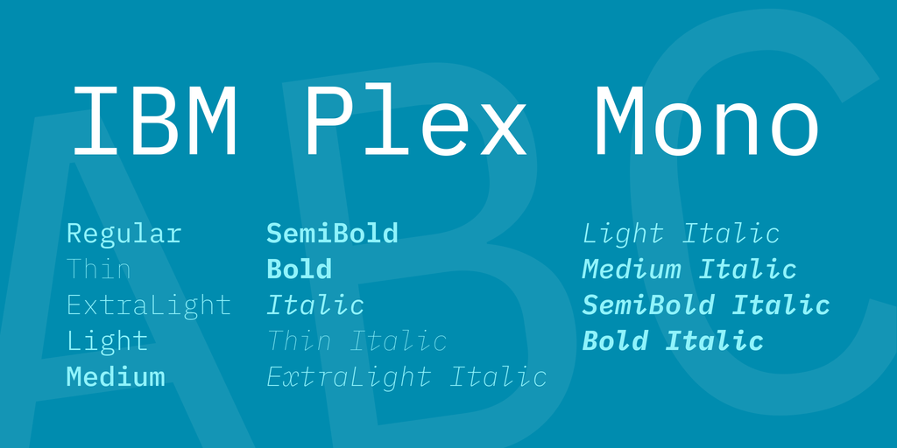
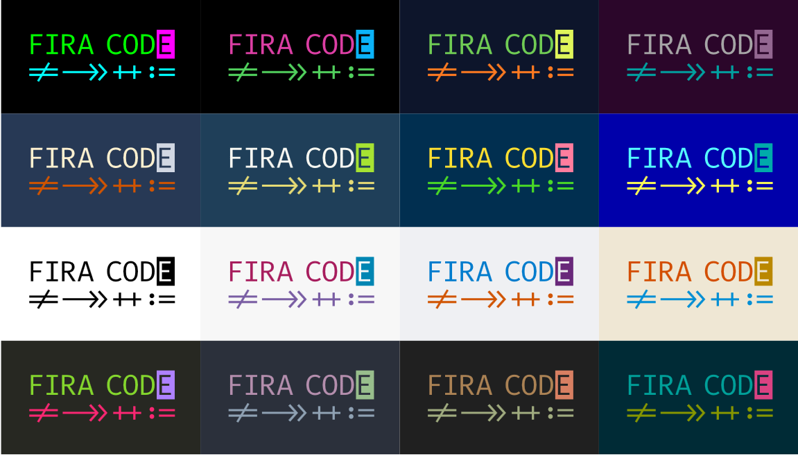

프로그래머라면 코딩할때 폰트를 굉장히 중요하게 생각할 수 있습니다. 기존에는 맥오에스 기본 폰트인 Menlo를 사용했었는데 최근 웹써핑 중 IBM Plex 폰트를 알게 됐습니다.
[IBM Plex 홈페이지](http://ibm.com/plex) 가 보시면 규모가 굉장히 큰 폰트입니다. Korean 즉 한글 폰트도 개발되었구요.

### IBM Plex Mono

추천드리고자 하는 폰트는 코딩할때 필요한 모노스페이스 폰트인 IBM Plex Mono 폰트입니다.

특히 아래와 같이 {} 같이 코딩할때 자주 쓰는 중괄호 모양이 인상적입니다.

다운로드는 [Github](https://github.com/IBM/plex/releases)에서 할 수 있습니다.

### Fira Code

Fira Code 코드는 아래 그림에서 볼수 있듯이, =>, ===, !== 등을 아주 멋지게 표현해 주고 있습니다.\
간혹 해외 유투브 보면서 ===, => 등 멋지게 표현되서 신기해 했었는데 Fira Code 폰트를 사용했더라구요.

공식 [Github 사이트](https://github.com/tonsky/FiraCode) 및 [다운로드 링크](https://github.com/tonsky/FiraCode/releases) 걸어드립니다.

