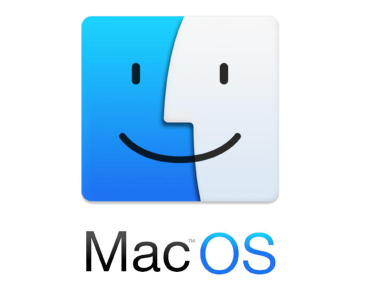

## 리눅스의 타일링 윈도우 매니저 i3

어제 오늘 유투브를 보다가 리눅스를 아주 능수능란하게 사용하는 유투버를 봤는데 아치리눅스상에서 i3란 타일링 윈도우 매니저를 사용하더라구요.

프로그래머라면 마우스보단 터미널 상에서 키보드를 많이 쓰는데 이 때 아주 잘 활용할 수 있겠다 싶고 또 내 해킨토시에 깔아 보고 싶어, 구글링해보고 일단 성공했습니다. 적응하는데 시간이 좀 걸리네요.

## 맥은 brew 죠

우분투에 apt-get, 아치리눅스 pacman이 있듯이 맥에서는 brew란 설치 스크립트를 이용하는데 역시나 chunkwm가 brew로 설치 할 수 있더라구요.

```
# clone tap
brew tap koekeishiya/formulae

# install latest stable version
brew install chunkwm
```

일단 chunkwm 을 설치하면 아래와 같이 설정파일을 홈폴더에 복사해야 된다.

```
cp /usr/local/Cellar/chunkwm/0.4.7/share/chunkwm/examples/chunkwmrc ~/.chunkwmrc
```

설치가 끝나고 일단 터미널 상에서 chunkwm 을 실행해 봤는데 윈도우가 타일링 형식으로 정렬되더라구요. 근데 문제가 있습니다. 유투브에서처럼 단축기로 윈도우를 제어하지 못하더라구요. 그래서 좀더 구글링 해보니까 chunkwm 은 순수하게 윈도우 매니저만 하고 맥오에스상의 키보드 제어는 다른 프로그램이 한다고 합니다. 이름하여 skhd란 어플입니다.

```
brew install koekeishiya/formulae/skhd
# 역시나 설정파일을 홈 폴더 밑에 복사해야 됩니다.
cp /usr/local/Cellar/skhd/0.3.0/share/skhd/examples/skhdrc ~/.skhdrc
```

자 skhd까지 실행하면 키 인풋으로 윈도우를 제어할 수 있습니다.

그런데 문제가 있습니다. 언제까지 터미널에서 chunkwm 이나 skhd 를 실행할 수 없겠더라구요. 그래서 좀더 알아보니까 brew 에도 백그라운드 서비스에 등록할 수 있는 명령어가 있더라구요. 백그라운드 서비스에 등록하면 맥오에스 구동시 자동으로 실행됩니다.

```
brew services restart chunkwm
brew services restart skhd
```

맥오에스 재시동해도 자동으로 잘 실행됩니다.

.skhdrc를 열어보면 키 설정을 할 수 있는데 맥오에스 기본 단축키랑 충돌되는 거는 피하고 새로 설정할 필요가 있더라구요.

2시간의 삽질로 드디어 리눅스의 i3 같은 타일링 윈도우 매니저를 내 해킨토시에서도 사용할 수 있게되어 매우 기쁘네요.
